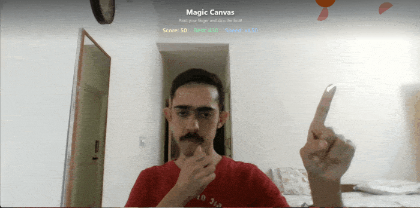

# 🍉 Magic Canvas — Hand-Tracked Fruit Slice

A browser-based, Fruit Ninja-style game controlled entirely by hand gestures — no mouse, no keyboard, no controller. Just point your finger at the camera and slice.

Built as a hands-on computer vision project to learn how to integrate a pre-trained AI model (MediaPipe's Hand Landmarker) into a real, interactive web application.

<!-- Add a screenshot or short GIF of gameplay here once ready -->
  

---

## How it works

Your webcam feed is analyzed in real time using **MediaPipe's Hand Landmarker** model, which detects 21 key points on your hand every frame. The app uses simple geometry on those points to recognize when your index finger is pointing, then tracks its position to draw a glowing blade trail. Fruits fall from the top of the screen under simulated gravity — swipe the blade through one to slice it and score points.

---

## Features

- **Real-time hand tracking** via webcam, no external sensors or controllers needed
- **Gesture recognition** — distinguishes a pointing finger from other hand shapes using distance-based geometry (not a separate trained model)
- **Fruit Ninja-style blade trail** — a tapering, glowing ribbon that follows the fingertip's motion
- **Physics-based falling fruit** — gravity, rotation, and randomized spawn positions
- **Collision detection** — checks whether the blade's path passed close enough to a fruit to count as a slice
- **Score tracking** with a **persistent high score** (saved locally via `localStorage`, so it survives closing the browser)
- **Progressive difficulty** — fruits fall faster as your score climbs, with a live "Speed" multiplier shown on screen
- **Full-screen, responsive layout**

---

## Tech stack

| Purpose | Tool |
|---|---|
| Structure | HTML5 |
| Styling / layout | CSS3 |
| Logic & game loop | JavaScript (ES Modules) |
| Hand detection | [MediaPipe Hand Landmarker](https://ai.google.dev/edge/mediapipe/solutions/vision/hand_landmarker) |
| Camera access | Web Camera API (`getUserMedia`) |
| Rendering | Canvas API |
| Score persistence | Browser `localStorage` |

---

## Running it locally

This project uses ES module imports and webcam access, both of which require the page to be served over `http://` — **opening `index.html` directly as a file will not work.**

1. Clone or download this repository.
2. Open the folder in VS Code.
3. Install the **Live Server** extension (by Ritwick Dey), if you don't have it already.
4. Right-click `index.html` → **Open with Live Server**.
5. Allow camera access when your browser prompts you.

---

## Controls

- ☝️ **Point** with just your index finger and move it to swing the blade.
- 🍎 **Swipe through falling fruit** to slice it and earn points.
- 📈 Fruits fall faster every **50 points** — watch the "Speed" indicator climb.
- 🏆 Your best score is saved automatically between sessions.

---

## Project progress

This project was built incrementally, phase by phase:

1. **Skeleton** — basic webcam feed rendered via the Web Camera API, with a canvas layered on top.
2. **Hand tracking** — integrated MediaPipe Hand Landmarker to detect 21 hand landmarks per frame in the live video stream.
3. **Gesture detection** — added logic to recognize pointing vs. other hand shapes using landmark distances.
4. **Effects** — iterated from a simple dot-tracking visual, to a flower/particle effect, to the current Fruit-Ninja-style blade trail.
5. **Gameplay** — reworked the project into a full-screen slicing game: falling fruit, physics, collision detection, and scoring.
6. **Bug fix** — resolved a coordinate mirroring issue where the blade moved opposite to the actual finger position.
7. **Difficulty scaling** — added a progressive speed increase (+0.5x fall speed every 50 points) with a live on-screen speed indicator.

---

## Notes & limitations

- Hand-tracking accuracy depends on lighting and camera angle.
- High scores are stored per-browser (via `localStorage`), not synced across devices.
- Gesture detection uses a simple heuristic (finger-tip vs. knuckle distance from the wrist) rather than a dedicated gesture-classification model — reliable for this project's needs, but not perfectly robust at every hand angle.

---

## Author

Built by **Mukund Gaur** — Computer Science Engineering (AI & ML) student, as a self-directed project while completing a Machine Learning internship at **FlyRank AI**.
